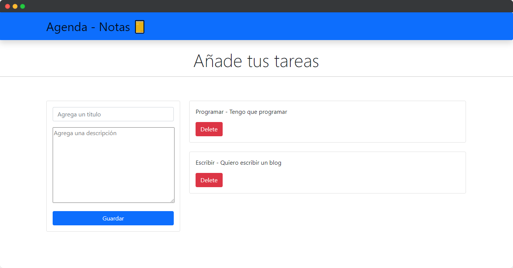

# Agenda - Tareas Javascript

Esta es una aplicación donde se aplican los paradigmas de programación orientada a objetos (POO) y se interactúa con la API del navegador localstorage con javascript

## Tecnologías Utilizadas

- HTML
- Boostrap
- Javascript
- JSON format

## Captura de la aplicación

